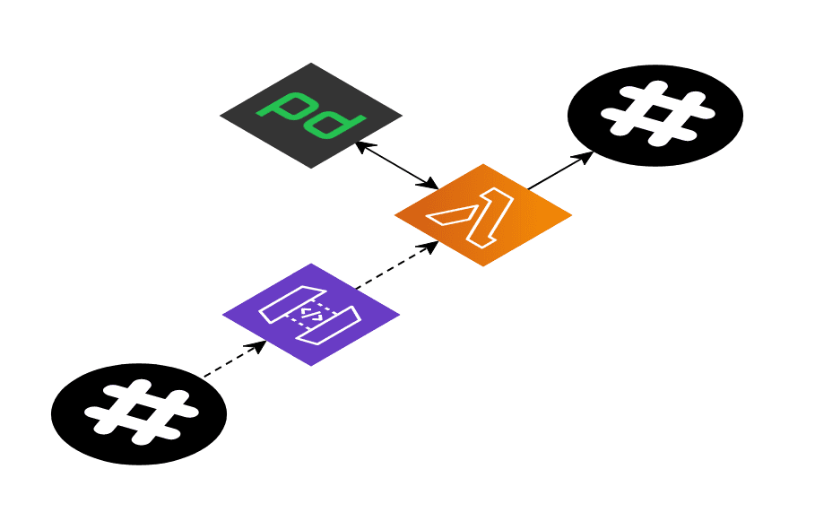

# sls-oncall

Slack bot that fetches user oncall given a schedule in PagerDuty.



This version of the app was made in conjuntion with the Schibsted engineering article
[Slack bot with Serverless Framework](https://medium.com/schibsted-engineering/slack-bot-with-serverless-framework-e96fcdbd83a0).

## Setup

Edit teams.json and add team name to schedule mappings

```json
[
  {
    "name": "team-name",
    "schedules": ["P989K9X", "PYXYZ9N"],
    "tags": ["alternative-name"]
  }
]
```

## Deployment

Make sure you have your credentials configured for the AWS CLI.

Before the first ever deploy in a environment, PagerDuty and Slack tokens need
to be stored in AWS Parameter Store under AWS Systems Manager.

```bash
$ aws ssm put-parameter --region=eu-west-1 --name "/sls-oncall/pd-token" --type "SecureString" --value "<YOUR PD TOKEN>"
$ aws ssm put-parameter --region=eu-west-1 --name "/sls-oncall/slack-token" --type "SecureString" --value "<YOUR SLACK TOKEN>"
$ aws ssm put-parameter --region=eu-west-1 --name "/sls-oncall/slack-signsecret" --type "SecureString" --value "<YOUR SLACK SIGN SECRET>"
```

You also need to setup the Slack app and respond to the Slack challenge.
Comment out `async: true` in the [serverless.yml](serverless.yml) file and deploy.
Once you have verified the url with Slack, comment it in and deploy again.

```bash
$ npx sls deploy --stage pro
```

## Security
https://api.slack.com/docs/verifying-requests-from-slack
